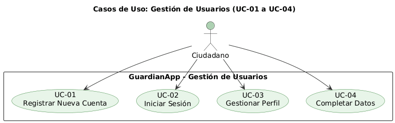
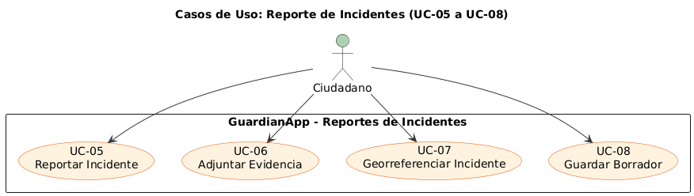
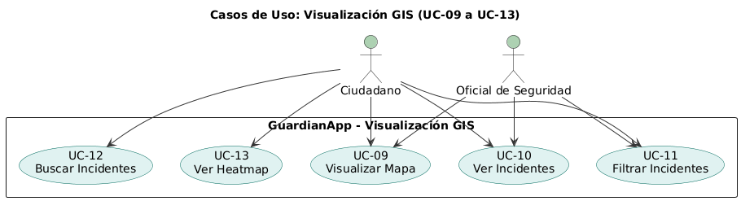
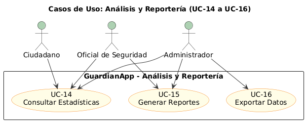
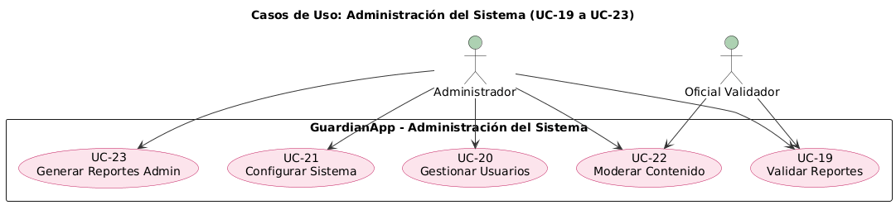
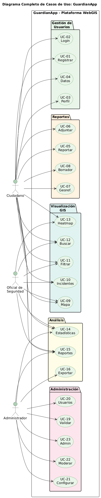

# Software Requirements Specification (SRS) v1.2
## GuardianApp - Plataforma WebGIS Participativa para Reporte de Incidentes de Seguridad

**Versión:** 1.2  
**Fecha:** 27 de marzo de 2026 (Revisión Final de Implementación)  
**Autor:** Julián Pantoja Clavijo  
**Institución:** Universidad Nacional Abierta y a Distancia (UNAD)  
**Estado del Documento:** Implementación Verificada — Preparado para Sustentación de Tesis  

---

## Control de Documentos

| Aspecto | Descripción |
|--------|------------|
| **Título** | Especificación de Requerimientos de Software GuardianApp v1.2 |
| **Versión** | 1.2  |
| **Estado** | IMPLEMENTACIÓN VERIFICADA  |
| **Responsable** | Julián Pantoja Clavijo |
| **Referencia** | SRS_GuardianApp_V1.2_Mar2026 |
| **Fecha Creación** | 16 de diciembre de 2025 |
| **Última Revisión** | 27 de marzo de 2026 |
| **Verificación** | Codebase producción cotejado con requerimientos |

---

## Tabla de Contenidos

1. [Introducción](#1-introducción)
2. [Descripción General del Producto](#2-descripción-general-del-producto)
3. [Requerimientos Funcionales](#3-requerimientos-funcionales-64-total)
4. [Requerimientos No Funcionales](#4-requerimientos-no-funcionales-41-total)
5. [Requerimientos de Interfaz](#5-requerimientos-de-interfaz)
6. [Arquitectura y Stack Tecnológico](#6-arquitectura-y-stack-tecnológico)
7. [Modelos de Análisis UML](#7-modelos-de-análisis-uml)
8. [Matriz de Trazabilidad](#8-matriz-de-trazabilidad)
9. [Glosario](#9-glosario)
10. [Referencias](#10-referencias)

---

## 1. Introducción

### 1.1 Propósito

Este documento de Especificación de Requerimientos de Software (SRS) v1.1 define formalmente los requerimientos de **GuardianApp**, una plataforma WebGIS participativa para el reporte de incidentes de seguridad en Bogotá, Colombia[1].

**Objetivos:**
- Crear canal participativo para ciudadanía en reportes de seguridad
- Visualizar espacialmente incidentes en mapas interactivos
- Generar estadísticas e inteligencia de seguridad
- Alinearse con ODS 16 (Paz, Justicia, Instituciones Sólidas)[2]
- Facilitar toma de decisiones basada en datos

### 1.2 Convenciones del Documento

| Término | Significado |
|---------|------------|
| **DEBE (SHALL)** | Requerimiento mandatorio para MVP |
| **DEBERÍA (SHOULD)** | Requerimiento para Fases 2-3 |
| **PUEDE (MAY)** | Requerimiento opcional |
| **FR-XX** | Requerimiento Funcional |
| **NFR-XX** | Requerimiento No Funcional |

### 1.3 Audiencia

Directivos UNAD, equipo de desarrollo, evaluadores técnicos, Alcaldía de Bogotá, ciudadanía.

### 1.4 Alcance MVP

**En Alcance:**
- Sistema autenticación y gestión usuarios (FR-01 a FR-10)
- Módulo reporte incidentes con georreferenciación (FR-11 a FR-25)
- Mapa WebGIS interactivo (FR-26 a FR-39)
- Dashboard estadísticas (FR-40 a FR-49)
- Panel administrativo (FR-50 a FR-60)
- Interfaz responsiva (desktop/móvil)

**Fuera de Alcance:**
- Integración con Policía Nacional
- Aplicación móvil nativa
- Machine Learning/análisis predictivo
- Reconocimiento facial

---

## 2. Descripción General del Producto

### 2.1 Perspectiva del Producto

GuardianApp es plataforma SaaS web-based que evoluciona como componente de Sistema de Información de Seguridad integral en Bogotá.

### 2.2 Funciones Principales

1. **Gestión de Usuarios:** Registro, autenticación, perfiles, roles
2. **Reporte de Incidentes:** Formulario, georreferenciación, evidencia, seguimiento
3. **Visualización GIS:** Mapas interactivos, heatmaps, capas temáticas
4. **Análisis:** Estadísticas, reportes, dashboards, exportación
5. **Administración:** Validación, moderación, configuración, auditoría

### 2.3 Características de Usuarios

| Usuario | Necesidades Principales |
|---------|--------------------------|
| **Ciudadano** | Reportar, visualizar mapa, consultar estadísticas |
| **Oficial Seguridad** | Validar, analizar patrones, generar reportes |
| **Administrador** | Gestionar usuarios, configurar, auditoría |

---

## 3. Requerimientos Funcionales (64 TOTAL)

### 3.1 Gestión de Usuarios - (10 FR)

| ID | Requerimiento | Prioridad |
|----|--------------|-----------|
| **FR-01** | DEBE permitir auto-registro con email o celular | CRÍTICA |
| **FR-02** | DEBE recopilar: nombre, email, teléfono, barrio, edad | CRÍTICA |
| **FR-03** | DEBE validar usuarios mayores de 16 años | CRÍTICA |
| **FR-04** | DEBE enviar correo de confirmación | ALTA |
| **FR-05** | DEBE permitir registro anónimo para reportes | MEDIA |
| **FR-06** | DEBE proteger datos con encriptación end-to-end | CRÍTICA |
| **FR-07** | DEBE implementar autenticación multifactor (MFA) opcional | MEDIA |
| **FR-08** | DEBE permitir recuperación de contraseña | ALTA |
| **FR-09** | DEBE cerrar sesiones tras 30 minutos inactividad | ALTA |
| **FR-10** | DEBE bloquear cuenta tras 5 intentos fallidos | ALTA |

**Subtotal: 10 FR**

### 3.2 Reporte de Incidentes - (15 FR)

| ID | Requerimiento | Prioridad |
|----|--------------|-----------|
| **FR-11** | DEBE proporcionar formulario estructurado | CRÍTICA |
| **FR-12** | DEBE incluir: tipo, descripción, fecha/hora, ubicación | CRÍTICA |
| **FR-13** | DEBE permitir selección de ubicación en mapa | CRÍTICA |
| **FR-14** | DEBE capturar automáticamente GPS si está disponible | ALTA |
| **FR-15** | DEBE permitir adjuntar fotos (máx 5, máx 5MB c/una) | ALTA |
| **FR-16** | DEBE permitir adjuntar videos (máx 50MB) | MEDIA |
| **FR-17** | DEBE mostrar vista previa de fotos | MEDIA |
| **FR-18** | DEBE permitir guardar borradores | ALTA |
| **FR-19** | DEBE generar ID único de seguimiento | CRÍTICA |
| **FR-20** | DEBE permitir reportes anónimos u identificados | ALTA |
| **FR-21** | DEBERÍA detectar reportes duplicados | MEDIA |
| **FR-22** | DEBE categorizar incidentes predefinidos | CRÍTICA |
| **FR-23** | DEBE permitir clasificar por severidad | ALTA |
| **FR-24** | DEBE mostrar estado del reporte | ALTA |
| **FR-25** | DEBE permitir ciudadano seguir estado su reporte | ALTA |

**Subtotal: 15 FR**

### 3.3 Visualización GIS - (14 FR)

| ID | Requerimiento | Prioridad |
|----|--------------|-----------|
| **FR-26** | DEBE mostrar mapa interactivo de Bogotá con incidentes | CRÍTICA |
| **FR-27** | DEBE permitir zoom, panneo, rotación | ALTA |
| **FR-28** | DEBE mostrar herramientas estándar (búsqueda, escala) | ALTA |
| **FR-29** | DEBE permitir activar/desactivar capas (barrios, hospitales) | MEDIA |
| **FR-30** | DEBE mostrar información en popup al hacer click | ALTA |
| **FR-31** | DEBE usar OpenStreetMap (código abierto) | CRÍTICA |
| **FR-32** | DEBE mostrar mapas de calor (heatmaps) por tipo incidente | MEDIA |
| **FR-33** | DEBE permitir ajustar rango temporal para heatmaps | MEDIA |
| **FR-34** | DEBE permitir búsqueda por dirección/barrio | ALTA |
| **FR-35** | DEBE permitir filtrar por tipo incidente | ALTA |
| **FR-36** | DEBE permitir filtrar por rango de fechas | ALTA |
| **FR-37** | DEBE permitir búsqueda geoespacial (radio X km) | MEDIA |
| **FR-38** | DEBERÍA mostrar clustering automático | MEDIA |
| **FR-39** | DEBERÍA exportar mapa como PNG/PDF | MEDIA |

**Subtotal: 14 FR**

### 3.4 Análisis y Reportería - (10 FR)

| ID | Requerimiento | Prioridad |
|----|--------------|-----------|
| **FR-40** | DEBE mostrar dashboard público con estadísticas básicas | ALTA |
| **FR-41** | DEBE mostrar gráficos: tipo incidente, mes, barrio | ALTA |
| **FR-42** | DEBE mostrar top 10 barrios más afectados | ALTA |
| **FR-43** | DEBE mostrar tasa de cambio (mes actual vs anterior) | MEDIA |
| **FR-44** | DEBERÍA mostrar análisis de tendencias | MEDIA |
| **FR-45** | DEBERÍA mostrar análisis por hora del día/día semana | MEDIA |
| **FR-46** | DEBE permitir generar reportes en PDF | ALTA |
| **FR-47** | DEBE permitir exportar datos a CSV/Excel | ALTA |
| **FR-48** | DEBE permitir seleccionar período de análisis | ALTA |
| **FR-49** | DEBERÍA permitir generar reportes automáticos | MEDIA |

**Subtotal: 10 FR**

### 3.5 Administración del Sistema - (11 FR)

| ID | Requerimiento | Prioridad |
|----|--------------|-----------|
| **FR-50** | DEBE permitir admin validar/rechazar reportes | CRÍTICA |
| **FR-51** | DEBE permitir cambiar clasificación de incidentes | ALTA |
| **FR-52** | DEBE permitir agregar comentarios internos | ALTA |
| **FR-53** | DEBE permitir marcar reportes como investigados | ALTA |
| **FR-54** | DEBE mantener auditoría de acciones admin | CRÍTICA |
| **FR-55** | DEBE permitir ver lista de usuarios registrados | ALTA |
| **FR-56** | DEBE permitir suspender/banear usuarios | ALTA |
| **FR-57** | DEBE permitir resetear contraseña de usuarios | ALTA |
| **FR-58** | DEBE permitir configurar tipos de incidentes | MEDIA |
| **FR-59** | DEBE permitir configurar niveles de severidad | MEDIA |
| **FR-60** | DEBE permitir configurar barrios/zonas | MEDIA |

**Subtotal: 11 FR**

### 3.6 Cumplimiento Ley 1581 de 2012 — Protección de Datos Personales (4 FR)

| ID | Requerimiento | Prioridad |
|----|--------------|-----------|
| **FR-61** | DEBE publicar página de Política de Tratamiento de Datos Personales (`/privacidad`) accesible de forma permanente y sin autenticación, conforme a lo establecido en la Ley 1581 de 2012 | CRÍTICA |
| **FR-62** | DEBE publicar página de Términos y Condiciones de Uso (`/terminos`) accesible de forma permanente y sin autenticación | ALTA |
| **FR-63** | DEBE mostrar en el pie de página (*footer*) de todas las vistas del sistema los hipervínculos a los documentos legales (Términos y Política de Privacidad) | CRÍTICA |
| **FR-64** | DEBE incluir en el formulario de registro una casilla de verificación (*checkbox*) de consentimiento explícito, vinculada a los documentos legales; la creación de cuenta DEBE ser bloqueada tanto en *frontend* como en *backend* si el usuario no marca dicha casilla | CRÍTICA |

**Subtotal: 4 FR**

---

## 4. Requerimientos No Funcionales (41 TOTAL)

### 4.1 Rendimiento (6 NFR)

| ID | Requerimiento | Métrica |
|----|--------------|--------|
| **NFR-01** | Tiempo de carga de página | < 3 segundos |
| **NFR-02** | Renderizado de mapa | < 2 segundos |
| **NFR-03** | Búsqueda/filtrado | < 1 segundo |
| **NFR-04** | Generación de reportes | < 10 segundos |
| **NFR-05** | Usuarios concurrentes soportados | 1,000 mínimo |
| **NFR-06** | Degradación bajo pico de carga | < 30% |

### 4.2 Seguridad (11 NFR)

| ID | Requerimiento |
|----|--------------|
| **NFR-07** | Encriptación en tránsito: TLS 1.3 mínimo[3] |
| **NFR-08** | Encriptación en reposo: AES-256 |
| **NFR-09** | Hashing de contraseñas: bcrypt/argon2 |
| **NFR-10** | Cumplimiento Ley 1266 de 2008 (Colombia)[4] |
| **NFR-11** | Cumplimiento principios GDPR (referencia)[5] |
| **NFR-12** | Protección CORS y CSRF |
| **NFR-13** | Auditoría de todas las acciones |
| **NFR-14** | Logs de seguridad retenidos 2 años mínimo |
| **NFR-15** | Protección OWASP Top 10 |
| **NFR-16** | Validación de entrada en todos formularios |
| **NFR-17** | Rate limiting contra brute force |

### 4.3 Confiabilidad (7 NFR)

| ID | Requerimiento |
|----|--------------|
| **NFR-18** | Disponibilidad: 99.5% uptime |
| **NFR-19** | Backup automático diario |
| **NFR-20** | Recovery Point Objective (RPO): 1 día máximo |
| **NFR-21** | Recovery Time Objective (RTO): 4 horas máximo |
| **NFR-22** | Redundancia de datos |
| **NFR-23** | Monitoreo activo con alertas |
| **NFR-24** | Manejo robusto de errores |

### 4.4 Usabilidad y Accesibilidad (9 NFR)

| ID | Requerimiento |
|----|--------------|
| **NFR-25** | Interfaz intuitiva sin capacitación compleja |
| **NFR-26** | Cumplimiento WCAG 2.1 Level AA[6] |
| **NFR-27** | Soporte para lectores de pantalla (JAWS, NVDA) |
| **NFR-28** | Navegación completa por teclado |
| **NFR-29** | Contraste color: mínimo 4.5:1 |
| **NFR-30** | Compatibilidad: Chrome, Firefox, Safari, Edge (últimas 2 v) |
| **NFR-31** | Diseño responsivo: desktop, tablet, smartphone |
| **NFR-32** | Tamaño texto ajustable hasta 200% |
| **NFR-33** | Multiidioma: español e inglés |

### 4.5 Mantenibilidad (8 NFR)

| ID | Requerimiento |
|----|--------------|
| **NFR-34** | Código modular y desacoplado |
| **NFR-35** | Documentación técnica completa |
| **NFR-36** | Pruebas unitarias: cobertura ≥ 70% |
| **NFR-37** | CI/CD con despliegue automático |
| **NFR-38** | Control de versiones (Git) |
| **NFR-39** | Containerización (Docker) |
| **NFR-40** | Base de datos portable (PostgreSQL + PostGIS)[7] |
| **NFR-41** | API REST documentada (OpenAPI/Swagger) |

---

## 5. Requerimientos de Interfaz

### 5.1 Página Principal
- Mapa prominente con incidentes
- Estadísticas resumidas
- Botón destacado "Reportar Incidente"
- Accesos rápidos a búsqueda/filtros

### 5.2 Formulario de Reporte
- Wizard de 4 pasos con validación en tiempo real
- Guardado automático de borradores
- Previsualizaciones de contenido

### 5.3 Mapa Interactivo
- Incidentes como marcadores diferenciados
- Leyenda interactiva
- Herramientas estándar

### 5.4 Dashboard Administrador (Implementado)

El panel administrativo cuenta con las siguientes secciones operacionales implementadas:

**KPIs en Tiempo Real:**
- Total de incidentes registrados (con filtro aplicado).
- Incidentes del día en curso.
- Total de usuarios y usuarios activos.

**Gráficos Analíticos:**
- **Reloj del Delito:** Gráfico de barras de distribución horaria (00:00–23:00). Permite identificar franjas de mayor actividad delictiva durante el día.
- **Top 5 Localidades:** Ranking dinámico de las 5 localidades de Bogotá con mayor número de reportes, vinculado a las geometrías oficiales PostGIS/IDECA.
- **Evolución Temporal:** Gráfico de línea que agrupa los incidentes por mes (vista anual) o por día (vista mensual o por rango de fechas).

**Mapa Analítico con Control de Capas:**
- Capa de **Mapa de Calor** (Leaflet.heat) con umbral de densidad calibrado para evidenciar hotspots orgánicos.
- Capa de **Agrupación de Marcadores** (Leaflet.markercluster) para visualización individual de incidentes.
- Capa de **Polígonos de Localidades** superpuesta sobre OpenStreetMap con los límites administrativos reales de Bogotá.
- Control `L.control.layers` para alternar entre capas de forma interactiva.

**Filtros Parametrizables:**
- Por año, mes, rango personalizado de fechas.
- Por una o múltiples categorías simultáneas (selección múltiple).

### 5.5 API REST GeoJSON

El sistema expone dos *endpoints* REST de solo lectura que proveen datos geoespaciales en formato GeoJSON estándar (RFC 7946), consumidos por la capa Leaflet del frontend:

| Endpoint | Método | Descripción | Filtros disponibles |
|---|---|---|---|
| `/api/geojson` | GET | `FeatureCollection` de incidentes con propiedades: categoría, color, estado, localidad, evidencias fotográficas | `days`, `year`, `month`, `start_date`, `end_date`, `categories[]` |
| `/api/localidades-geojson` | GET | `FeatureCollection` de los polígonos MultiPolygon de las 20 localidades de Bogotá (geometría oficial IDECA) | — |

Ambos *endpoints* utilizan la función `ST_AsGeoJSON()` de PostGIS para serializar la geometría directamente desde la base de datos, garantizando precisión y eficiencia.

### 5.6 Paleta de Colores y Estilo Visual

Esta paleta corresponde a la implementación actual en `layouts/app.blade.php`:

| Uso | Color | Código Hex |
|---|---|---|
| **Primario (Branding)** | Negro | #0A0A0A |
| **Secundario (Texto)** | Gris Medio | #706F6C |
| **Acción / Peligro** | Rojo | #DC2626 |
| **Fondo General** | Gris Claro | #E5E5E5 |
| **Superficies (Cards)** | Blanco | #FFFFFF |
| **Texto Principal** | Negro Off | #1B1B18 |
| **Bordes** | Gris | #D4D4D4 |
| **Éxito** | Verde | #10B981 |
| **Info** | Azul | #3B82F6 |

---

## 6. Arquitectura y Stack Tecnológico

### 6.1 Arquitectura General
GuardianApp utiliza una arquitectura MVC (Modelo-Vista-Controlador) monolítica, optimizada para un desarrollo rápido y seguro.

```
guardianapp/
├── app/
│   ├── Console/Commands/        # Comandos Artisan (ej: guardian:seed-today)
│   ├── Http/Controllers/        # Lógica de Control
│   │   ├── Admin/               # Controladores del panel administrativo
│   │   └── Api/                 # Controladores de la API REST (GeoJSON)
│   └── Models/                  # Modelos Eloquent + Geoespacial (PostGIS)
├── database/
│   ├── data/                    # Datos computados (localidades.sql - IDECA)
│   ├── migrations/              # Definición de Schema
│   └── seeders/                 # Datos Semilla (LocalidadSeeder, DemoIncidentSeeder)
├── resources/
│   ├── views/
│   │   ├── admin/               # Vistas del panel administrativo
│   │   ├── auth/                # Vistas de autenticación
│   │   ├── legal/               # Vistas de documentos legales (Ley 1581)
│   │   └── layouts/             # Layout maestro (app.blade.php)
│   └── js/                      # Lógica Frontend (Vanilla JS + Leaflet)
├── routes/
│   ├── web.php                  # Rutas Web (incluyendo /privacidad, /terminos)
│   └── api.php                  # Rutas API (/api/geojson, /api/localidades-geojson)
└── docs/                        # Documentación del proyecto (SRS, diagramas)
```

### 6.2 Stack Tecnológico Exacto

| Capa | Tecnología | Versión | Notas |
|---|---|---|---|
| **Backend Framework** | Laravel | 11.x | Versión en producción |
| **Lenguaje** | PHP | 8.2+ | |
| **Base de Datos** | PostgreSQL | 15.x | Relacional |
| **Extensión Espacial** | PostGIS | 3.x | Tipos `Point`, `MultiPolygon`; funciones `ST_Intersects()`, `ST_AsGeoJSON()`; índices `GIST` |
| **Fuente de Datos Geoespaciales** | IDECA | — | Shapefiles oficiales de las 20 localidades de Bogotá |
| **Frontend** | Blade + Vanilla JS | ES6+ | Sin SPA framework pesado |
| **Estilos** | CSS Variables | — | Custom properties; sin framework externo |
| **Mapas** | Leaflet.js | 1.9.4 | Librería de mapas open-source |
| **Plugins Leaflet** | Leaflet.heat + Leaflet.markercluster | — | Heatmap y agrupación de marcadores |

### 6.3 Capa de Datos Geoespaciales (PostGIS / IDECA)

El sistema implementa una capa de datos geoespacial completa sobre PostgreSQL + PostGIS para la gestión de información territorial de Bogotá:

**Fuente de datos:** Infraestructura de Datos Espaciales para el Distrito Capital (IDECA), Alcaldía Mayor de Bogotá. Shapefiles de límites oficiales de las 20 localidades en sistema de referencia WGS84 (SRID: 4326).

**Proceso de carga:**
1. Conversión de Shapefile → volcado SQL con herramientas PostGIS (`shp2pgsql`).
2. Almacenamiento en `database/data/localidades.sql` como fuente de verdad versionada en el repositorio.
3. Inyección automática al ejecutar `php artisan migrate:fresh --seed` mediante `LocalidadSeeder`.

**Asignación automática de localidad:**
Cada incidente creado en el sistema invoca el método `Incident::assignLocalidad()`, que ejecuta la consulta espacial `ST_Intersects(location, geom)` para vincular automáticamente el punto GPS del reporte con el polígono de la localidad correspondiente.

**Índices espaciales:** Tablas `localidades` e `incidents` cuentan con índices `GIST` para garantizar rendimiento en consultas geoespaciales a escala.

**Comando de demostración:** El comando `php artisan guardian:seed-today --count=N` permite la inyección de N incidentes del día en curso con distribución orgánica (80% en hotspots estratégicos, 20% como ruido de fondo), sin afectar el historial existente. Diseñado para uso en presentaciones y demostraciones en vivo.

---

## 7. Modelos de Análisis UML

### 7.1 Actores del Sistema

**Ciudadano:** Reporta incidentes, visualiza mapas, consulta estadísticas

**Oficial Seguridad:** Valida reportes, analiza patrones, genera reportes

**Administrador:** Gestiona usuarios, configura sistema

### 7.2 Casos de Uso Principales

**Gestión de Usuarios:** UC-01 a UC-04 (Registro, Login, Perfil)  

**Reportes:** UC-05 a UC-08 (Reportar, Adjuntar, Georreferenciar, Borrador)  

**Visualización:** UC-09 a UC-13 (Mapa, Ver, Filtrar, Buscar, Heatmap)  

**Análisis:** UC-14 a UC-16 (Estadísticas, Reportes, Exportar)  

**Administración:** UC-19 a UC-23 (Validar, Gestionar, Configurar, Moderar)  

**Diagrama Completo:** 


---

## 8. Matriz de Trazabilidad 

| ID | Descripción | Casos de Uso | Prioridad | MVP |
|----|------------|-------------|-----------|-----|
| **FR-01** | Auto-registro | UC-01 | CRÍTICA | ✓ |
| **FR-02** | Datos usuario | UC-01 | CRÍTICA | ✓ |
| **FR-03** | Validar edad | UC-01 | CRÍTICA | ✓ |
| **FR-04** | Confirmación email | UC-01 | ALTA | ✓ |
| **FR-05** | Registro anónimo | UC-01 | MEDIA | ✓ |
| **FR-06** | Encriptación datos | UC-01 | CRÍTICA | ✓ |
| **FR-07** | MFA opcional | UC-02 | MEDIA | ✓ |
| **FR-08** | Recuperar contraseña | UC-02 | ALTA | ✓ |
| **FR-09** | Cerrar sesión inactiva | UC-02 | ALTA | ✓ |
| **FR-10** | Bloquear tras intentos | UC-02 | ALTA | ✓ |
| **FR-11** | Formulario reporte | UC-05 | CRÍTICA | ✓ |
| **FR-12** | Campos formulario | UC-05 | CRÍTICA | ✓ |
| **FR-13** | Seleccionar ubicación | UC-05 | CRÍTICA | ✓ |
| **FR-14** | Capturar GPS | UC-05 | ALTA | ✓ |
| **FR-15** | Adjuntar fotos | UC-06 | ALTA | ✓ |
| **FR-16** | Adjuntar videos | UC-06 | MEDIA | ✓ |
| **FR-17** | Vista previa fotos | UC-06 | MEDIA | ✓ |
| **FR-18** | Guardar borradores | UC-08 | ALTA | ✓ |
| **FR-19** | ID seguimiento | UC-05 | CRÍTICA | ✓ |
| **FR-20** | Reportes anónimos | UC-05 | ALTA | ✓ |
| **FR-21** | Detectar duplicados | UC-05 | MEDIA | ✓ |
| **FR-22** | Categorizar incidentes | UC-05 | CRÍTICA | ✓ |
| **FR-23** | Clasificar severidad | UC-05 | ALTA | ✓ |
| **FR-24** | Mostrar estado | UC-05 | ALTA | ✓ |
| **FR-25** | Seguir reporte | UC-05 | ALTA | ✓ |
| **FR-26** | Mapa interactivo | UC-09 | CRÍTICA | ✓ |
| **FR-27** | Zoom/panneo | UC-09 | ALTA | ✓ |
| **FR-28** | Herramientas mapa | UC-09 | ALTA | ✓ |
| **FR-29** | Capas temáticas | UC-09 | MEDIA | ✓ |
| **FR-30** | Popup info | UC-09 | ALTA | ✓ |
| **FR-31** | OpenStreetMap | UC-09 | CRÍTICA | ✓ |
| **FR-32** | Heatmaps | UC-13 | MEDIA | ✓ |
| **FR-33** | Rango temporal | UC-13 | MEDIA | ✓ |
| **FR-34** | Búsqueda dirección | UC-12 | ALTA | ✓ |
| **FR-35** | Filtrar tipo | UC-11 | ALTA | ✓ |
| **FR-36** | Filtrar fechas | UC-11 | ALTA | ✓ |
| **FR-37** | Búsqueda geoespacial | UC-12 | MEDIA | ✓ |
| **FR-38** | Clustering | UC-09 | MEDIA | ✓ |
| **FR-39** | Exportar mapa | UC-09 | MEDIA | ✓ |
| **FR-40** | Dashboard estadísticas | UC-14 | ALTA | ✓ |
| **FR-41** | Gráficos | UC-14 | ALTA | ✓ |
| **FR-42** | Top 10 barrios | UC-14 | ALTA | ✓ |
| **FR-43** | Tasa cambio | UC-14 | MEDIA | ✓ |
| **FR-44** | Tendencias | UC-14 | MEDIA | ✓ |
| **FR-45** | Análisis temporal | UC-14 | MEDIA | ✓ |
| **FR-46** | Reportes PDF | UC-15 | ALTA | ✓ |
| **FR-47** | Exportar CSV | UC-16 | ALTA | ✓ |
| **FR-48** | Período análisis | UC-15 | ALTA | ✓ |
| **FR-49** | Reportes automáticos | UC-15 | MEDIA | ✓ |
| **FR-50** | Validar reportes | UC-19 | CRÍTICA | ✓ |
| **FR-51** | Reclasificar | UC-19 | ALTA | ✓ |
| **FR-52** | Comentarios internos | UC-19 | ALTA | ✓ |
| **FR-53** | Marcar investigado | UC-19 | ALTA | ✓ |
| **FR-54** | Auditoría acciones | UC-20 | CRÍTICA | ✓ |
| **FR-55** | Listar usuarios | UC-20 | ALTA | ✓ |
| **FR-56** | Suspender/banear | UC-20 | ALTA | ✓ |
| **FR-57** | Resetear contraseña | UC-20 | ALTA | ✓ |
| **FR-58** | Configurar tipos | UC-21 | MEDIA | ✓ |
| **FR-59** | Configurar severidad | UC-21 | MEDIA | ✓ |
| **FR-60** | Configurar barrios | UC-21 | MEDIA | ✓ |

---

## 9. Glosario

| Término | Definición |
|---------|-----------|
| **GIS** | Sistema de Información Geográfica |
| **WebGIS** | GIS basado en tecnología web |
| **Georreferenciación** | Asignación de coordenadas GPS |
| **Heatmap** | Mapa de calor mostrando densidad |
| **MFA** | Autenticación Multifactor |
| **JWT** | JSON Web Token |
| **WCAG** | Web Content Accessibility Guidelines |
| **MVP** | Producto Mínimo Viable |
| **PostGIS** | Extensión espacial PostgreSQL, utilizada para queries geoespaciales avanzadas |
| **ODS** | Objetivos Desarrollo Sostenible |

---

## 10. Referencias

[1] Pantoja Clavijo, J. (2025). Plataforma WebGIS participativa para reporte de incidentes de seguridad en Bogotá. [Manuscrito inédito]. Universidad Nacional Abierta y a Distancia.

[2] Naciones Unidas. (2015). Objetivos de Desarrollo Sostenible. https://www.un.org/sustainabledevelopment/

[3] Internet Engineering Task Force (IETF). (2018). The Transport Layer Security (TLS) Protocol Version 1.3 (RFC 8446). https://tools.ietf.org/html/rfc8446

[4] Congreso de Colombia. (2008). Ley 1266 de 2008. Diario Oficial, 46.948.

[5] Parlamento Europeo. (2016). Reglamento (UE) 2016/679 sobre protección de datos. Diario Oficial de la Unión Europea, L 119, 1-88.

[6] World Wide Web Consortium (W3C). (2018). Web Content Accessibility Guidelines (WCAG) 2.1. https://www.w3.org/WAI/WCAG21/quickref/

[7] PostGIS Project. (2024). PostGIS 3.4 Manual. https://postgis.net/documentation/

---

## ANEXOS

### Anexo A: Resumen Ejecutivo

**Total de Requerimientos (v1.2):**
- Requerimientos Funcionales (FR): 64 *(+4 FR-61 a FR-64 Ley 1581)*
- Requerimientos No Funcionales (NFR): 41
- **TOTAL: 105 requerimientos**

**Distribución por Prioridad:**
- CRÍTICA: 18 (17%)
- ALTA: 56 (53%)
- MEDIA: 31 (30%)

**Cobertura MVP:**
- Todas las 5 áreas funcionales cubiertas
- Todos los requerimientos de seguridad implementados
- Accesibilidad y usabilidad priorizadas
- Cumplimiento regulatorio garantizado

### Anexo B: Estimación de Esfuerzo

| Módulo | Horas | Semanas |
|--------|-------|---------|
| Autenticación | 80 | 2 |
| Reporte Incidentes | 120 | 3 |
| Visualización GIS | 140 | 4 |
| Análisis/Reportería | 100 | 3 |
| Administración | 80 | 2 |
| Testing | 120 | 3 |
| Documentación | 60 | 2 |
| **TOTAL** | **700** | **19-20 semanas** |

---

**Documento Verificado:** 16 de diciembre de 2025  
**Revisión Final:** 27 de marzo de 2026 — Implementación cotejada con codebase en producción  
**Estado:** IMPLEMENTACIÓN VERIFICADA — Preparado para Sustentación de Tesis
